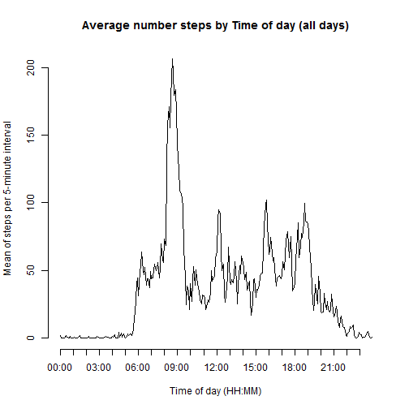
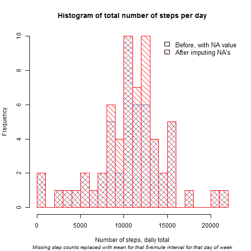

## Downloading the data
Activity data was obtained from the URL  <https://d396qusza40orc.cloudfront.net/repdata%2Fdata%2Factivity.zip>, stored and unzipped in a folder called 'data' in my R Studio work directory like this:


```r
if (!file.exists("./data")) { # Create a data folder if needed
        dir.create("./data") 
} 

url = "https://d396qusza40orc.cloudfront.net/repdata%2Fdata%2Factivity.zip?accessType=DOWNLOAD"

destfile = file.path( "./data" , "Activity monitoring data.zip" )

setInternet2(use = TRUE) ## Neccessary for download.file to work with knitr on Windows 7
if (!file.exists(destfile)) { # Download zipped file if it is not already done
        download.file( url = url, 
                       destfile = destfile, 
                       mode = "wb") # Windows. Other OS may use method=curl
} 

datafolder <- file.path("./data" , "activity.csv")

if (!file.exists(datafolder)) { # Unzip it if it is not already done
        unzip(destfile, exdir='./data')  
}
```

Note that the `setInternet2` option had to be set on my Windows 7 system for download.file to work with knitr. It is only available on Windows, so if you are on another OS you must omit that line, and also most likely have to change mode="wb" to method="curl". Alternatively, you can change the url from https: to http:.


## Reading data into R and preprocessing it
The activity file has 17568 observations of three variables -  `date`, `interval` and `steps`. It is here read into the data frame `activity`. The date string is here converted to R date format. The interval comes as numbers from 0 to 2355. I made the assumption that this is hours and minutes, so here the interval variable is temporarily changed to character, string manipulated to get HH:MM and then reverted back to a factor for plotting. The last step of the preprocessing is inserting `dayofweek`. I do it already here because my approach requires this English weekday name both in the NA imputing and in the last plot.


```r
if (!exists("activity")) {activity <- read.csv("./data/activity.csv")} ## 17568 obs. of 3 variables

activity$date <- as.Date(activity$date, format="%Y-%m-%d")

activity$interval <- as.character(activity$interval)
require(stringr) ## For str_pad() to simplify padding
activity$interval <- str_pad(activity$interval, 4, pad="0") ## pad so we get HHMM 
activity$interval <- sub("([[:digit:]]{2,2})$", ":\\1", activity$interval) ##Insert colon to get HH:MM
activity$interval <- as.factor(activity$interval)  ## Prepare it for inclusion in plot axis

oldlocale <- Sys.getlocale(category="LC_TIME") ## Store current locale datetime setting
Sys.setlocale(category = "LC_TIME", locale = "C")  ## Change locale to C language default locale
```

```
## [1] "C"
```

```r
activity$dayofweek <- weekdays(activity$date) ## For use both in imputing NAs and in the last plot 
```

The default C language locale has English day names, so this code gets reproducible everywhere. The locale is reverted back to your original settings in a later code segment below.

## What is mean total number of steps taken per day?

**Calculate total number of steps taken per day**  

```length(unique(activity$interval))``` shows 288 different 5-minute intervals, that is consistent with the number of 5-minute intervals per 24 hours. So the number of steps can be summed directly.


```r
plot1.data <- aggregate(steps~date, data=activity, sum)
```

**Make a histogram with total number of steps taken each day**

```r
hist(plot1.data$steps,
     main="Histogram of total number of steps per day",
     breaks=round(max(plot1.data$steps)/1000,0), ## Bins of 1000
     xlab="Number of steps, daily total", 
     col="#3182bd",
     density=10,
     angle=45
     )

rug(plot1.data$steps)
```

 

**Calculate and report mean and median number of steps per day**


```r
df <- as.data.frame(list(as.character(mean(plot1.data$steps)), median(plot1.data$steps)))
names(df) <- c("Mean", "Median")
require(pander)
pander(df, caption="Calculated mean and median:") ## Output in a table format
```


-------------------------
      Mean        Median 
---------------- --------
10766.1886792453  10765  
-------------------------

Table: Calculated mean and median:

## What is the average daily activity pattern?

**Time series plot of the 5-minute intervals and the average number of steps taken, averaged across all days.**  
First, I aggregate the plot data into `plot2.data` as the mean of steps per interval.

```r
plot2.data <- aggregate(steps~interval, data=activity, mean)
names(plot2.data)[names(plot2.data)=="steps"] <- "mean.of.steps"
```
Then the time series plot:

```r
plot(x=as.numeric(plot2.data$interval), 
     y=plot2.data$mean.of.steps, 
     type="l",
     axes=FALSE, 
     xlab="Time of day (HH:MM)", 
     ylab="Mean of steps per 5-minute interval", 
     main="Average number steps by Time of day (all days)")

lbl = plot2.data$interval[seq(1, length(plot2.data$interval), 12)]  ## Picking every 12th of the 288 intervals (top of every hour 00-23) 

axis(side=1, at=lbl, labels=lbl)

axis(side=2)
```

 


**Which 5-minute interval, on average across all the days in the dataset, contains the maximum number of steps?**  
From `plot2.data`, which rows are the ones with the highest value in column 2 (mean.of.steps):

```r
plot2.data[which(plot2.data[, 2] == max(plot2.data[, 2])), ]
```

```
##     interval mean.of.steps
## 104   08::35      206.1698
```
It is interval 104, original interval label 835 (i.e. 08:35-08.40), where the mean is 206.1698.


## Imputing missing values
Several days/intervals have missing values (coded as NA). 

**Calculate and report the total number of missing values in the dataset (i.e. the total number of rows with NAs)**

```r
sum(!complete.cases(activity))
```

```
## [1] 2304
```
There are 2304 rows with NA's (of 17568 obs. total, i.e. 15264 complete cases). 

```r
summary(activity) 
```

```
##      steps             date               interval      dayofweek        
##  Min.   :  0.00   Min.   :2012-10-01   00::00 :   61   Length:17568      
##  1st Qu.:  0.00   1st Qu.:2012-10-16   00::05 :   61   Class :character  
##  Median :  0.00   Median :2012-10-31   00::10 :   61   Mode  :character  
##  Mean   : 37.38   Mean   :2012-10-31   00::15 :   61                     
##  3rd Qu.: 12.00   3rd Qu.:2012-11-15   00::20 :   61                     
##  Max.   :806.00   Max.   :2012-11-30   00::25 :   61                     
##  NA's   :2304                          (Other):17202
```
It is only `steps` which has these NA values.

**Devise a strategy for filling in all of the missing values in the dataset**  
Simple strategy chosen: Replace (in `steps`) NA with the mean for that 5-minute interval for that weekday.

**Create a new dataset that is equal to the original dataset but with the missing data filled in, and add mean of steps per interval and day of week to original data** 
Note that day of week was included in the preprocessing code chunk above.  

First, a new calculation of means, this time for steps by interval and weekday. 

```r
idm <- aggregate(steps~interval+dayofweek, data=activity, mean)
names(idm)[names(idm)=="steps"] <- "mean.of.steps"
```
Then use that to create the new dataset with the missing data filled in.

```r
activity.imputed <- merge(x = activity,
                          y = idm, 
                          by = c("interval","dayofweek"), 
                          all.x = TRUE) ## Left outer join

activity.imputed$steps.old <- activity.imputed$steps  ## Just for sanity check of the imputing

activity.imputed$steps[is.na(activity.imputed$steps)] <- 
        activity.imputed$mean.of.steps[is.na(activity.imputed$steps)] ##Replace NA with mean for interval+day 

summary(activity.imputed)
```

```
##     interval      dayofweek             steps             date           
##  00::00 :   61   Length:17568       Min.   :  0.00   Min.   :2012-10-01  
##  00::05 :   61   Class :character   1st Qu.:  0.00   1st Qu.:2012-10-16  
##  00::10 :   61   Mode  :character   Median :  0.00   Median :2012-10-31  
##  00::15 :   61                      Mean   : 37.57   Mean   :2012-10-31  
##  00::20 :   61                      3rd Qu.: 19.04   3rd Qu.:2012-11-15  
##  00::25 :   61                      Max.   :806.00   Max.   :2012-11-30  
##  (Other):17202                                                           
##  mean.of.steps      steps.old     
##  Min.   :  0.00   Min.   :  0.00  
##  1st Qu.:  0.00   1st Qu.:  0.00  
##  Median : 12.57   Median :  0.00  
##  Mean   : 37.57   Mean   : 37.38  
##  3rd Qu.: 55.43   3rd Qu.: 12.00  
##  Max.   :328.57   Max.   :806.00  
##                   NA's   :2304
```

**Make a histogram of the total number of steps taken each day**  
First aggregating steps by date in the imputed data set.

```r
plot3.data <- aggregate(steps~date, data=activity.imputed, sum)
```
Then first create a histogram with the data as the were originally, just for an easier comparison, then add the new layer with imputed data.

```r
hist(plot1.data$steps,
     main="Histogram of total number of steps per day",
     breaks=round(max(plot1.data$steps)/1000,0), ## Bins of 1000
     xlab="Number of steps, daily total", 
     ylim=c(0,10),
     col="#3182bd",
     density=10,
     angle=45
)

# Then add a layer with the data where NA's have been replaced with values.
hist(plot3.data$steps,
     breaks=round(max(plot1.data$steps)/1000,0), ## Bins of 1000
     col="red",
     density=10,
     angle=135,
     add=TRUE
)

title(sub="Missing step counts replaced with mean for that 5-minute interval for that day of week", 
      font.sub=3, cex.sub=0.8)

legend(14000,10, 
       c("Before, with NA values", "After imputing NA's"), 
       cex=1.1,
       fill=c("#3182bd", "red"), density=10, angle=c(45,135), 
       bty="n")
```

 

  
The bins for 8000-10000 and 11000-13000 are those with an increase.  


**... and calculate and report the mean and median total number of steps taken per day.**  
Do these values differ from the estimates from the first part of the assignment? What is the impact of imputing missing data on the estimates of the total daily number of steps?

The mean increases from 10766.19 to 10821.21, and the median changes from 10765 to 11015.

```r
mean(plot3.data$steps) 
```

```
## [1] 10821.21
```

```r
median(plot3.data$steps)
```

```
## [1] 11015
```

The total number of steps increases by 89485.79 using this imputing strategy.

```r
sum(activity.imputed$steps) - sum(activity$steps, na.rm=TRUE) 
```

```
## [1] 89485.79
```


## Are there differences in activity patterns between weekdays and weekends?
Using the `activity.imputed` dataset with the filled-in missing values for this part.  

**Create a new factor variable in the dataset with two levels - "weekday" and "weekend", ** indicating whether a given date is a weekday or weekend day. The factor variable I call `partofweek`. 

```r
weekenddays <- c("Saturday","Sunday")  ## English day names, as locale was set to C above

activity.imputed$partofweek <- factor(weekdays(activity.imputed$date) %in% weekenddays, 
                                      levels=c(TRUE, FALSE), labels=c("weekend","weekday"))
```
Your locale setting can now be reverted back to the original language with the R code `Sys.setlocale(category = "LC_TIME", locale = oldlocale)`  

**Make a panel plot containing a time series plot of the 5-minute interval and the average number of steps taken, averaged across all weekday days or weekend days**.   
Building and using the `plot4.data` data frame for this, and plotting with the lattice library. 

```r
plot4.data <- aggregate(steps~interval+partofweek, data=activity.imputed, mean)
names(plot4.data)[names(plot4.data)=="steps"] <- "mean.of.steps"

require(lattice)
xyplot(mean.of.steps ~ interval | partofweek, data=plot4.data, 
       type="l", 
       layout=c(1,2),
       xlab="Time of day (Hour)",
       ylab="Mean of steps taken per 5-minute interval",
       main="Different activity patterns between weekdays and weekends",
       scales=list( ##Every 12th 5-minute interval, i.e. top of every hour
               x=list(
                       at=seq(0, 288,12), 
                       labels=0:24
                       ) 
               ) 
       )
```

 


